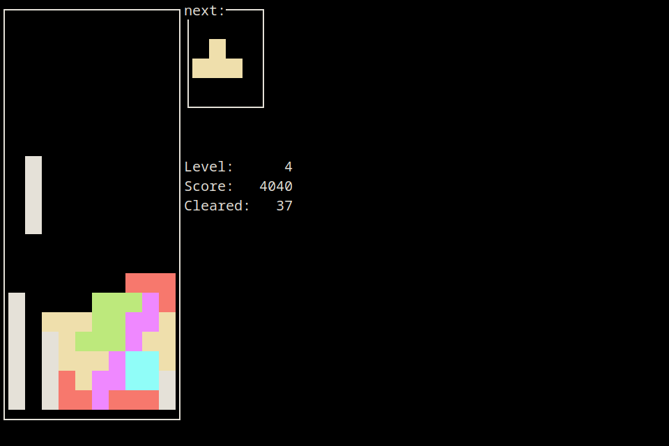

# Tetris

A Tetris clone that runs in your terminal!



# Dependancies
**Rust**: Built with version "1.70.0", but older versions likely work fine.

**ncurses**: Built with version "6.4", but i'm sure much much older versions would work as well.

# Building
Run `cargo build`

# Controls
```
  Left Arrow ← = Move piece left
 Right Arrow → = Move piece right
    Up Arrow ↑ = Rotate piece
  Down Arrow ↓ = Toggle accelerate for current piece
             p = Pause
             q = Quit
```